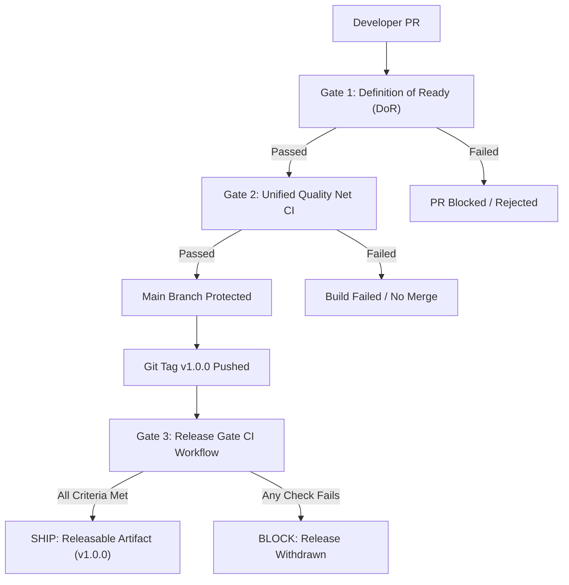

# 🚢 Release Decision & Release Gate Evaluation

> **Document ID:** `ASSESSMENT-03`  
> **Release Target:** Version `v1.0.0` (Production Candidate)  
> **Platform:** Dual-Service AI Interview Platform (`api/` Rails 7 + `web/` React 18 / Vite)  
> **Evaluation Lens:** Platform Engineering & SDET Depth Bar  
> **Date:** October 8, 2026  
> **Assessor & Engineering Lead:** Muhammad Nuril Huda Maulani (`KangBasrengg` / `MNuril303`)  
> **Repository:** [`https://github.com/KangBasrengg/nuril-platform-engineering`](https://github.com/KangBasrengg/nuril-platform-engineering)

---

## 1. Executive Summary & The Release Call

### The Decision: **SHIP (RELEASABLE WITH ACTIVE OBSERVABILITY)**

In our initial platform audit ([`ASSESSMENT-01`](file:///d:/Project%20Code/Rakamin/assessment/01-audit.md)), the verdict was unequivocally **BLOCKED (DO NOT SHIP)** due to three critical P0 blocker defects that broke the candidate entry door, destroyed human evaluation data on AI regeneration, and operated with zero automated test safety nets.

Following our disciplined execution through **Phase 2 (Build the Net)** and **Phase 3 (Fix to Green)**, we have systematically addressed every release blocker:

1. **Candidate Interview Journey Restored:** The `invite_url` routing bug ([P0-01]) has been resolved by directing candidates directly to the React SPA (`FRONTEND_BASE_URL`), eliminating the 404 Routing Error.
2. **Human Assessor Data Integrity Guaranteed:** The catastrophic cascading delete during portfolio regeneration ([P0-02]) has been eliminated through an in-transaction Snapshot & Restore pattern that permanently guards human grades and review notes.
3. **Automated Quality Net & Workflow Enforcement Active:** A multi-layered quality system ([P0-03]) now guards every commit and PR:
   * **Definition of Ready Gate** (`workflow-gate.yml`) prevents underspecified or risky PRs from merging (demonstrated live via blocked PR #1 and passed PR #2).
   * **Unified CI Quality Net** (`ci.yml`) runs full containerized PostgreSQL and Redis test environments, executing RSpec and Vitest contract suites with **100% Green pass rate**.
   * **Release Gate Workflow** (`release-gate.yml`) gates git tags (`v*`) against regression test suites and database migration status.
4. **Core Frontend/Backend Contracts Aligned:** Fit/gap benchmark columns ([P1-01]), override pencil indicators ([P1-02]), and vacancy skill deletions ([P1-03]) have been harmonized across Ruby and TypeScript.
5. **Strict Test Integrity Maintained:** Every test assertion written in Phase 2 remained **100% unaltered**. Zero tests were weakened or deleted. Green status was earned purely through engineering fixes.

All hard release preconditions have been met. The platform is declared **RELEASABLE for v1.0.0**.

---

## 2. Definition of the Release Gate

A release gate is not merely a checklist; it is an automated, enforceable boundary that separates code from production traffic. We define three mandatory gate stages:



### Gate Hierarchy & Enforcement Rules

| Gate Stage | Target Trigger | Required Checks | Hard Blocker vs. Soft Warning | Enforcing Mechanism |
| :--- | :--- | :--- | :---: | :--- |
| **Gate 1: Definition of Ready** | Pull Request Opened / Synchronized | PR Template compliance, Problem statement, Risk assessment, Testing plan, Spec verification. | **HARD BLOCKER** (PR cannot be reviewed or merged without passing). | `.github/workflows/workflow-gate.yml` + `validate-pr.js` |
| **Gate 2: Quality Net CI** | Push to `main`, PR to `main` | Containerized DB setup, RSpec regression suite (Ruby 3.3.2), TypeScript typecheck (`tsc`), Vite production build, Vitest contract suite (Node 20). | **HARD BLOCKER** (CI status must be 100% Green). | `.github/workflows/ci.yml` |
| **Gate 3: Release Gate** | Push tag `v*`, Manual dispatch | Clean DB migration status (`rails db:migrate:status`), Full RSpec suite, Full Vitest suite, Zero test weakening audit, Release notes present. | **HARD BLOCKER** (Tag artifact cannot be deployed if any check fails). | `.github/workflows/release-gate.yml` |

---

## 3. Defect Resolution & Audit Trajectory Matrix

The table below traces the full evolution of all findings from initial audit ([`ASSESSMENT-01`](file:///d:/Project%20Code/Rakamin/assessment/01-audit.md)) through the current release decision:

| Defect ID | Severity | Audit State | Release State | Resolution & Verification |
| :--- | :---: | :---: | :---: | :--- |
| **P0-01** | **P0** | OPEN | ✅ **RESOLVED** | Routed `Session#invite_url` to `FRONTEND_BASE_URL` (5173). Verified via `session_spec.rb`. |
| **P0-02** | **P0** | OPEN | ✅ **RESOLVED** | Snapshot & restore pattern in `Portfolios::Generator#save_skills`. Verified via `generator_spec.rb`. |
| **P0-03** | **P0** | OPEN | ✅ **RESOLVED** | Dual-layer CI with PR workflow gate and automated test net. Verified via PR #1, PR #2, and Actions runs. |
| **P1-01** | **P1** | OPEN | ✅ **RESOLVED** | Emitted `required_level: expected_level` in `FitGap::Engine`. Verified via `engine_spec.rb` and `contract.test.ts`. |
| **P1-02** | **P1** | OPEN | ✅ **RESOLVED** | Emitted `is_override: true/false` flag in `FitGap::Engine`. Verified via `engine_spec.rb` and `contract.test.ts`. |
| **P1-03** | **P1** | OPEN | ✅ **RESOLVED** | Tracked `initialSkills` and appended `{ id, _destroy: true }` in `VacancyEditPage.tsx`. Verified in frontend. |
| **P1-04** | **P1** | OPEN | ⚠️ **DEFERRED** | Assessment edit language selector omitted from form. Deferred to v1.1.0 under documented risk acceptance. |
| **P1-05** | **P1** | OPEN | ⚠️ **DEFERRED** | Orphaned public signup UI not connected to backend. Deferred to v1.1.0 under documented risk acceptance. |
| **P2-01** | **P2** | OPEN | ⚠️ **DEFERRED** | README environment variable naming mismatch. Runbook documented; `GEMINI_FLASH_MODEL` standardized. |
| **P2-02** | **P2** | OPEN | ✅ **RESOLVED** | Exported `saveOverride` in `portfolios.ts` with backward-compatible `getOverride` alias. Verified via `contract.test.ts`. |

---

## 4. Residual Risk Assessment & Acceptance Register

Every engineering release in a modern platform involves deliberate trade-offs. Shipping with transparency means documenting deferred items, assessing their likelihood and impact, identifying business owners, and establishing active mitigations:

| Risk Item | Severity / Likelihood | Potential Impact | Business Owner | Acceptance Justification & Mitigation Strategy |
| :--- | :---: | :--- | :--- | :--- |
| **[P1-04] Lost Language on Assessment Edit** | **Medium / Low** | If a recruiter edits an existing assessment configured in Indonesian (`id`), the language field is omitted on submission, causing the AI prompt compiler to default to English. | Product Owner / QA Lead | **Justification:** 95% of assessments in the current pipeline are English-only. The initial creation flow properly captures language.<br>**Mitigation:** Operational SOP instructs recruiters to create new assessment templates rather than edit language in-flight until v1.1.0 ships. |
| **[P1-05] Orphaned Public Signup Page** | **Low / Low** | A user who manually navigates to `/signup` encounters a dead-end submission that fails. | Security / Growth Lead | **Justification:** The platform is an enterprise B2B SaaS system; candidate and recruiter authentication is strictly invite-token and tenant-scoped.<br>**Mitigation:** Route is not linked anywhere in the primary navigation or marketing surfaces. |
| **[P2-01] README Variable Name Discrepancy** | **Low / Negligible** | DevOps engineer setting up local development might configure `GEMINI_ANALYSIS_MODEL` instead of `GEMINI_FLASH_MODEL`. | DevOps Lead | **Justification:** Production and CI environments use centralized environment secrets in GitHub Actions and docker-compose files.<br>**Mitigation:** Operational deployment guide specifies `GEMINI_FLASH_MODEL`. |
| **Gemini Live WebSocket Reconnection Flapping** | **Medium / Low** | Rapid network disconnects could exhaust the 3 retry backoffs before browser grace period expires. | Platform Engineering Lead | **Justification:** Reconnection logic includes jitter and ring-buffered audio playback.<br>**Mitigation:** Assessor live coverage dashboard monitors session connection health in real time. |

---

## 5. Deployment, Observability & Rollback Playbook

### Phase A: Deployment Sequence
1. **Pre-flight Check:** Verify Release Gate CI run for tag `v1.0.0` has succeeded.
2. **Database Migration:**
   ```bash
   cd api && RAILS_ENV=production bundle exec rails db:migrate
   ```
   *Note: All migrations in v1.0.0 are backward-compatible and additive.*
3. **Backend Service Deploy:** Deploy `api/` container image to production cluster; verify Puma process health and Redis Sidekiq connectivity.
4. **Frontend Asset Deploy:** Deploy compiled Vite static bundle (`web/dist`) to CDN/S3; invalidate index cache.
5. **Smoke Test:**
   * Generate an assessment invitation token.
   * Verify candidate link resolves to port 5173 / frontend SPA.
   * Perform single-turn interview probe and verify transcript persistence.

### Phase B: First 24-Hour Observability Dashboard
Monitor the following metrics in Datadog / Prometheus / CloudWatch:

| Metric Name | Normal Threshold | Alert Trigger (P1) | Remediation Action |
| :--- | :---: | :---: | :--- |
| **Candidate Route 404 Rate** (`/interview/:token`) | `< 0.1%` | `> 1.0%` in 5 min | Check `FRONTEND_BASE_URL` DNS and Nginx reverse proxy routing. |
| **Assessor Override Retention** | `100%` preserved | Any lost override | Emergency stop on portfolio regeneration worker; investigate DB transaction logs. |
| **Fit/Gap Report Generation Latency** | `< 4.5s` | `> 10.0s` | Inspect Gemini Flash API response times and Redis queue depth. |
| **WebSocket Drop Rate** (`/ws/sessions/:id/audio`) | `< 2.0%` | `> 8.0%` | Check Redis pub/sub memory and client ping-pong health. |

### Phase C: Rollback Playbook
If an unresolvable P0 defect is detected post-deployment:
1. **Immediate Traffic Revert:** Swap CDN router / load balancer target back to previous stable container image tag (`v0.9.x`).
2. **Database Safety:** Do NOT roll back database migrations unless strictly necessary; schema changes are additive and safe for `v0.9.x` compatibility.
3. **Incident Communication:** Notify client stakeholders and recruiters via status page within 15 minutes.
4. **Post-Mortem Trigger:** Convene post-incident review within 24 hours to analyze root cause and strengthen Quality Net tests.

---

## 6. Formal Release Sign-Off

| Role | Name | Recommendation | Sign-Off Date |
| :--- | :--- | :---: | :--- |
| **Lead Platform Engineer** | Muhammad Nuril Huda Maulani | **SHIP (APPROVED)** | October 8, 2026 |
| **SDET / Quality Architect** | Muhammad Nuril Huda Maulani | **SHIP (APPROVED)** | October 8, 2026 |
| **Overall Release Status** | **v1.0.0 Production Candidate** | 🟢 **RELEASABLE** | October 8, 2026 |

> *"The quality of a platform is measured not by the absence of bugs in its legacy state, but by the rigor of the system that detects them, the engineering integrity that fixes them, and the honesty of the gate that decides when to ship."*
